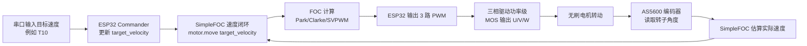

# DengFOC V3 控制框图和接线图

本文用于理解 DengFOC V3 + AS5600 + 无刷电机的基本连接和控制流程。没有硬件时，可以先按本文画图和检查代码中的引脚。

## 1. 闭环速度控制框图

闭环控制要画出“目标值、控制器、驱动板、电机、编码器反馈”这几部分。



简化理解：

```text
目标速度
  -> SimpleFOC 比较目标速度和实际速度
  -> 算出三相 PWM
  -> 驱动板输出 U/V/W 三相电
  -> 电机转动
  -> AS5600 反馈角度
  -> SimpleFOC 再修正
```

其中：

| 模块 | 作用 |
| --- | --- |
| 串口输入 | 给目标速度或目标位置，例如 `T10` |
| ESP32 | 运行 SimpleFOC 算法，输出 PWM |
| AS5600 | 测量电机转子角度，是闭环反馈来源 |
| 三相驱动功率级 | 把 ESP32 的 PWM 小信号放大成能驱动电机的三相电 |
| 无刷电机 | 被控制对象 |

## 2. 开环速度控制框图

开环没有编码器反馈，控制器不知道电机有没有真正跟上。


开环适合初次确认驱动输出和电机接线，但不适合长期堵转或高负载运行。

## 3. AS5600 闭环接线图

### 3.1 总体接线

```text
12-24V 电源 +  ----------------> DengFOC V3 电源输入 +
12-24V 电源 -  ----------------> DengFOC V3 电源输入 - / GND

DengFOC V3 M0 三相输出 U/V/W  --> 电机0 三相线
DengFOC V3 M1 三相输出 U/V/W  --> 电机1 三相线

AS5600 编码器0 ---------------> DengFOC V3 编码器0接口
AS5600 编码器1 ---------------> DengFOC V3 编码器1接口

电脑 USB ---------------------> DengFOC V3 ESP32 USB/串口
```

### 3.2 电机0 AS5600 接线

代码对应：

```cpp
I2Cone.begin(19, 18, 400000UL);  // SDA0, SCL0
```

| AS5600 引脚 | DengFOC V3 接口 | ESP32 引脚 | 作用 |
| --- | --- | --- | --- |
| VCC | 3.3V | 3.3V | 编码器供电 |
| GND | GND | GND | 公共地 |
| SDA | SDA_0 | GPIO19 | I2C 数据线 |
| SCL | SCL_0 | GPIO18 | I2C 时钟线 |
| DIR | GND 或 3.3V | 可选 | 改变角度方向 |

### 3.3 电机1 AS5600 接线

代码对应：

```cpp
I2Ctwo.begin(23, 5, 400000UL);  // SDA1, SCL1
```

| AS5600 引脚 | DengFOC V3 接口 | ESP32 引脚 | 作用 |
| --- | --- | --- | --- |
| VCC | 3.3V | 3.3V | 编码器供电 |
| GND | GND | GND | 公共地 |
| SDA | SDA_1 | GPIO23 | I2C 数据线 |
| SCL | SCL_1 | GPIO5 | I2C 时钟线 |
| DIR | GND 或 3.3V | 可选 | 改变角度方向 |

## 4. 电机和驱动引脚对应关系

### 4.1 电机0

代码：

```cpp
BLDCDriver3PWM driver = BLDCDriver3PWM(32, 33, 25, 22);
```

| 功能 | ESP32 引脚 |
| --- | --- |
| PWM A | GPIO32 |
| PWM B | GPIO33 |
| PWM C | GPIO25 |
| Enable | GPIO22 |

### 4.2 电机1

代码：

```cpp
BLDCDriver3PWM driver1 = BLDCDriver3PWM(26, 27, 14, 12);
```

| 功能 | ESP32 引脚 |
| --- | --- |
| PWM A | GPIO26 |
| PWM B | GPIO27 |
| PWM C | GPIO14 |
| Enable | GPIO12 |

这些 PWM 引脚不是直接接电机，而是先进入板上的三相驱动电路，再由驱动电路输出 U/V/W 三相电给电机。

## 5. 手画图时的画法

建议分两张图画：

1. 控制框图  
   只画信息流：目标速度、ESP32、SimpleFOC、驱动板、电机、AS5600 反馈。

2. 接线图  
   只画实际线缆：电源线、电机三相线、AS5600 的 VCC/GND/SDA/SCL、USB 串口。

不要把控制框图和接线图混在一张图里，否则很容易乱。

## 6. 上电后的验证顺序

有硬件后按这个顺序验证：

```text
1. 只接 USB 和 AS5600，跑 3_IIC双编码器测试
2. 手转电机轴，看串口角度是否变化
3. 接低压限流电源和电机，跑开环速度测试
4. 确认电机能低速平稳转动
5. 跑闭环速度测试
6. 如果抖动或反转，检查极对数、相序、编码器方向
```

