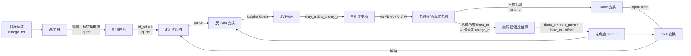
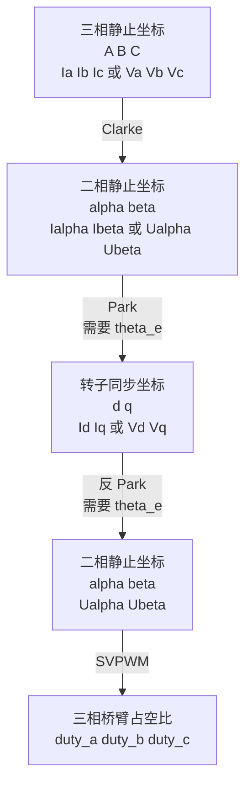

# FOC 变换输入输出图

这张图用来说明 FOC 仿真中各个模块的输入、输出，以及变量在哪个坐标系下。

## 1. 总体闭环图



核心顺序是：

```text
目标速度
  -> 速度 PI
  -> Iq_ref
  -> d/q 电流 PI
  -> Vd/Vq
  -> 反 Park
  -> Ualpha/Ubeta
  -> SVPWM
  -> duty_a/duty_b/duty_c
  -> 三相桥
  -> 电机
  -> 电流/角度反馈
  -> Clarke/Park
  -> Id/Iq
```

## 2. 坐标系变换关系



可以记成：

```text
反馈电流路径：
Ia/Ib/Ic -> Clarke -> Ialpha/Ibeta -> Park -> Id/Iq

控制输出路径：
Vd/Vq -> 反 Park -> Ualpha/Ubeta -> SVPWM -> duty_a/duty_b/duty_c
```

## 3. 每个模块的输入输出

| 模块 | 输入 | 输出 | 作用 |
| --- | --- | --- | --- |
| 编码器 | 机械角度 `theta_m` | 电角度 `theta_e` | 告诉 FOC 当前转子磁场方向 |
| 速度 PI | `omega_ref - omega_m` | `Iq_ref` | 速度不够就增大转矩电流 |
| Clarke | `Ia/Ib/Ic` | `Ialpha/Ibeta` | 把三相电流压缩成二维静止坐标 |
| Park | `Ialpha/Ibeta + theta_e` | `Id/Iq` | 站在转子视角看电流 |
| d 轴 PI | `Id_ref - Id` | `Vd` | 把 d 轴电流压到接近 0 |
| q 轴 PI | `Iq_ref - Iq` | `Vq` | 让实际转矩电流跟随目标 |
| 反 Park | `Vd/Vq + theta_e` | `Ualpha/Ubeta` | 把转子坐标电压转回定子坐标 |
| SVPWM | `Ualpha/Ubeta + Vbus` | `duty_a/b/c` | 计算三相桥臂 PWM 占空比 |
| 三相逆变桥 | `duty_a/b/c` | `Va/Vb/Vc` | 把直流母线变成三相电压 |
| 电机模型 | `Va/Vb/Vc`、负载 | `theta_m`、`omega_m`、`Ia/Ib/Ic` | 模拟电机电气和机械响应 |

## 4. 变量属于哪个坐标系

```text
三相坐标：
Ia, Ib, Ic
Va, Vb, Vc
duty_a, duty_b, duty_c

alpha/beta 静止坐标：
Ialpha, Ibeta
Ualpha, Ubeta

d/q 转子同步坐标：
Id, Iq
Vd, Vq

机械量：
theta_m
omega_m

电角度：
theta_e = pole_pairs * theta_m - zero_electric_angle
```

## 5. 对应代码位置

| 功能 | 文件 |
| --- | --- |
| Clarke/Park/反 Park | `src/foc_math.py` |
| SVPWM | `src/svpwm.py` |
| 电机 dq 模型 | `src/motor_model.py` |
| 速度环、电流环、完整闭环流程 | `src/simulator.py` |
| R/L、摩擦、惯性辨识 | `src/identification.py` |
| 摩擦/惯性前馈补偿 | `src/compensation.py` |

