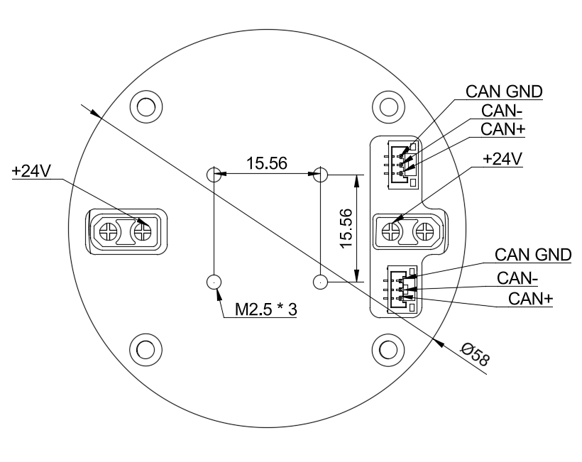

# Drivex2 双编码器关节电机使用手册

## 1. 产品概述

**Drivex2** 是一款基于 [rdrivec1](https://gitee.com/switchpi/rdrive-controller-c1) 无刷电机控制器的高性能一体化关节电机模组。它集成了 4310 无刷电机与 1:31 谐波减速器，双编码器控制器，专为机器人关节、机械臂、外骨骼等高精度力控应用设计。

### 核心特性

- **高精度双编码器架构**：电机侧 + 输出侧双磁编码器（AS5048a/AS5600），14-bit 分辨率（CPR 16384），支持编码器补偿表，消除谐波齿轮非线性误差
- **FOC 矢量控制**：30kHz PWM 频率，电流环 + 位置环级联控制，支持电流前馈与反电动势前馈
- **CAN FD 总线通信**：亚毫秒级通信延迟，支持多关节级联组网（最多 15 个节点）
- **MIT 风格阻抗控制**：支持 Kp/Kd 增益缩放，可实现柔顺力控与刚性位置控制的无缝切换
- **内置安全保护**：过温保护（75°C 故障温度）、过流保护（1.8A 最大电流）、超时保护

---

## 2. 4310 电机参数

| 参数 | 单位 | 数值 |
|------|------|------|
| 额定电压 (Nominal Voltage) | V | 24 |
| 额定电流 (Nominal Current) | A | 0.9 |
| 额定扭矩 (Nominal Torque) | N·m | 0.2 |
| 额定转速 (Nominal Speed) | RPM | 504 |
| 最大转速 (Max Speed) | RPM | 1028 |
| 堵转扭矩 (Stall Torque) | N·m | 0.49 |
| 堵转电流 (Stall Current) | A | 1.9 |
| 绕线匝数 (Winding Turns) | T | 60 |
| 相电阻 (Phase Resistance) | Ω | 10.32 |
| 相电感 (Phase Inductance) | mH | 3.26 |
| 转速常数 (Speed Constant) | rpm/V | 34.4 |
| 扭矩常数 (Torque Constant) | N·m/A | 0.23 |
| 转子惯量 (Rotor Inertia) | g·cm² | 202 |
| 极对数 (Pole Pairs) | — | 14 |
| 电机重量（不含编码器） | g | 112.1 |
| 电机重量（含编码器） | g | 128.4 |
| 编码器类型 | — | AS5048a / AS5600 |
| 工作温度范围 | °C | 20 ~ 80 |

---

## 3. 机械尺寸说明

该图说明了关节电机后盖的安装孔距以及端子接口定义。



*图：后盖安装尺寸与接口图。固定孔为 M2.5 * 3，孔距 15.56mm；外径 Ø58；包含双 CAN 接口及 +24V 电源端子。*

---

## 4. Drivex2 关节性能综合描述

### 减速比与输出性能

Drivex2 采用 **1:31 谐波减速器**（配置文件中 `motor_position.rotor_to_output_ratio = 0.032275`，即约 1/31）。经减速后，关节输出端性能如下：

| 指标 | 数值 |
|------|------|
| 关节输出额定扭矩 | ≈ 6.2 N·m |
| 关节输出峰值扭矩 | ≈ 15.2 N·m |
| 关节输出额定转速 | ≈ 16.3 RPM |
| 关节输出最大转速 | ≈ 33.2 RPM |
| 位置分辨率（输出侧） | < 0.022° |

### 控制器配置摘要


| 参数路径 | 值 | 说明 |
|----------|-----|------|
| `motor.poles` | 28 | 极数（14 极对） |
| `motor.resistance_ohm` | 5.37 Ω | 标定相电阻 |
| `motor.Kv` | 33.6 | 标定 Kv 值 |
| `servo.pid_position.kp` | 900.0 | 位置环比例增益 |
| `servo.pid_position.ki` | 900.0 | 位置环积分增益 |
| `servo.pid_position.kd` | 9.0 | 位置环微分增益 |
| `servo.max_current_A` | 1.8 A | 最大电流限制 |
| `servo.default_velocity_limit` | 0.4 rev/s | 默认速度限制 |
| `servo.default_accel_limit` | 1.0 rev/s² | 默认加速度限制 |
| `servo.fault_temperature` | 75 °C | 故障温度阈值 |
| `servo.max_voltage` | 54 V | 最大电压 |
| `servo.pwm_rate_hz` | 30000 | PWM 频率 |
| `id.id` | 1 | 出厂默认 CAN ID |

### 编码器系统

Drivex2 采用双编码器架构：

- **Source 0**（电机侧）：SPI 接口磁编码器，CPR=16384，用于 FOC 换相，配有 62 点补偿表
- **Source 1**（输出侧）：SPI 接口磁编码器，CPR=16384，用于关节绝对位置反馈，PLL 滤波 400Hz

---

## 5. 环境准备

### 安装 moteus Python 库

```bash
conda create -n x2 python=3.12.12 
conda activate x2 
git clone https://gitee.com/switchpi/dummyx2
cd dummyx2/acuator/moteus/lib/python
pip3 install moteus nicegui
cd ../utils/
python3 webgui.py #to verify installation correctly
```

### 硬件连接

将 Drivex2 通过 CAN FD 总线连接到上位机。推荐使用 **fdcanusb** 适配器（USB 转 CAN FD）。

---

## 6. Python 入门示例

### 5.1 连接到 CAN ID 为 1 的关节并移动到指定位置

```python
#!/usr/bin/env python3
"""连接到 CAN ID=1 的 Drivex2 关节，移动到指定位置"""
import asyncio
import math
import moteus

async def main():
    # 创建控制器实例，指定 CAN ID = 1
    controller = moteus.Controller(id=1)

    # 清除故障，进入停止状态
    await controller.set_stop()
    print("已连接到 CAN ID=1 的关节电机")

    # 移动到 0.5 圈的位置 (即输出轴旋转 180°)
    # velocity=0.2 限制运动速度，accel_limit=0.5 限制加速度
    target_position = 0.5  # 单位: rev (圈)
    state = await controller.set_position(
        position=target_position,
        velocity=0.2,           # rev/s
        accel_limit=0.5,        # rev/s²
        query=True
    )

    if state:
        pos = state.values.get(moteus.Register.POSITION, 0)
        print(f"目标位置: {target_position} rev, 当前位置: {pos:.4f} rev")

    # 等待电机到达目标位置
    print("等待电机到位...")
    await asyncio.sleep(3.0)

    # 读取最终状态
    state = await controller.query()
    if state:
        pos = state.values.get(moteus.Register.POSITION, 0)
        print(f"最终位置: {pos:.4f} rev")

    # 停止电机
    await controller.set_stop()
    print("电机已停止")

if __name__ == '__main__':
    asyncio.run(main())
```

### 5.2 扫描总线上的所有关节

```python
#!/usr/bin/env python3
"""扫描 CAN 总线上所有在线的 Drivex2 关节"""
import asyncio
import moteus

async def main():
    print("正在扫描 CAN 总线上的关节电机 (ID: 1~15)...\n")

    found_joints = []

    for can_id in range(1, 16):
        try:
            c = moteus.Controller(id=can_id)
            state = await asyncio.wait_for(c.query(), timeout=0.3)
            if state:
                pos = state.values.get(moteus.Register.POSITION, None)
                voltage = state.values.get(moteus.Register.VOLTAGE, None)
                found_joints.append({
                    'id': can_id,
                    'position': pos,
                    'voltage': voltage
                })
                print(f"  [✓] ID={can_id:2d}  位置={pos:.4f} rev  电压={voltage:.1f} V")
        except Exception:
            pass  # 该 ID 无响应，跳过

    print(f"\n扫描完成，共发现 {len(found_joints)} 个在线关节")

if __name__ == '__main__':
    asyncio.run(main())
```

### 5.3 获取关节实时参数（位置、速度、扭矩、温度、电流）

```python
#!/usr/bin/env python3
"""实时读取 Drivex2 关节的位置、速度、扭矩、温度和电流"""
import asyncio
import moteus

async def main():
    # 配置查询分辨率：请求温度和电压字段
    qr = moteus.QueryResolution()
    qr.temperature = moteus.INT16
    qr.voltage = moteus.INT16
    qr.q_current = moteus.F32      # q 轴电流
    qr.d_current = moteus.F32      # d 轴电流

    controller = moteus.Controller(id=1, query_resolution=qr)
    await controller.set_stop()

    print("实时监控关节参数 (按 Ctrl+C 停止)\n")
    print(f"{'位置(rev)':>10} {'速度(rev/s)':>12} {'扭矩(Nm)':>10} "
          f"{'温度(°C)':>10} {'电压(V)':>8} {'Iq(A)':>8} {'Id(A)':>8}")
    print("-" * 80)

    try:
        while True:
            state = await controller.query()
            if state:
                pos  = state.values.get(moteus.Register.POSITION, 0)
                vel  = state.values.get(moteus.Register.VELOCITY, 0)
                trq  = state.values.get(moteus.Register.TORQUE, 0)
                temp = state.values.get(moteus.Register.TEMPERATURE, 0)
                volt = state.values.get(moteus.Register.VOLTAGE, 0)
                iq   = state.values.get(moteus.Register.Q_CURRENT, 0)
                id_  = state.values.get(moteus.Register.D_CURRENT, 0)

                print(f"{pos:10.4f} {vel:12.4f} {trq:10.4f} "
                      f"{temp:10.1f} {volt:8.1f} {iq:8.3f} {id_:8.3f}",
                      end="\r")

            await asyncio.sleep(0.02)  # 50Hz 更新率
    except KeyboardInterrupt:
        print("\n\n监控已停止")

if __name__ == '__main__':
    asyncio.run(main())
```

### 5.4 指定扭矩、速度和加速度控制

```python
#!/usr/bin/env python3
"""
按照指定的最大扭矩、速度和加速度移动关节
moteus 的 set_position 可以同时设置 velocity_limit、accel_limit 和 maximum_torque
"""
import asyncio
import math
import moteus

async def main():
    controller = moteus.Controller(id=1)
    await controller.set_stop()

    # ===== 控制参数 =====
    target_position = 1.0     # 目标位置: 1.0 rev (360°)
    max_torque      = 3.0     # 最大扭矩: 3.0 Nm
    max_velocity    = 0.3     # 最大速度: 0.3 rev/s
    max_accel       = 0.5     # 最大加速度: 0.5 rev/s²

    print(f"移动到 {target_position} rev")
    print(f"  最大扭矩:   {max_torque} Nm")
    print(f"  最大速度:   {max_velocity} rev/s")
    print(f"  最大加速度: {max_accel} rev/s²")

    try:
        while True:
            state = await controller.set_position(
                position=target_position,
                velocity=0.0,                  # 目标到达时的速度 = 0
                maximum_torque=max_torque,
                velocity_limit=max_velocity,
                accel_limit=max_accel,
                query=True
            )
            if state:
                pos = state.values.get(moteus.Register.POSITION, 0)
                vel = state.values.get(moteus.Register.VELOCITY, 0)
                trq = state.values.get(moteus.Register.TORQUE, 0)
                print(f"位置: {pos:.4f} rev | 速度: {vel:.4f} rev/s | 扭矩: {trq:.3f} Nm", end="\r")

                # 到达目标位置后退出
                if abs(pos - target_position) < 0.005 and abs(vel) < 0.05:
                    print(f"\n已到达目标位置: {pos:.4f} rev")
                    break

            await asyncio.sleep(0.02)
    except KeyboardInterrupt:
        pass
    finally:
        await controller.set_stop()
        print("电机已停止")

if __name__ == '__main__':
    asyncio.run(main())
```

### 5.5 MIT 风格阻抗控制（Kp/Kd 模式）

MIT 控制的核心公式为：

```
τ = Kp × (p_des - p_act) + Kd × (v_des - v_act) + τ_ff
```

在 moteus 中，通过 `kp_scale` 和 `kd_scale` 参数缩放控制器内部的 PID 增益来实现：

```python
#!/usr/bin/env python3
"""
MIT 风格阻抗控制示例
通过缩放 moteus 内部的 Kp/Kd 增益，实现柔顺力控
"""
import asyncio
import math
import moteus

# ===== 从配置文件读取的控制器内部 PID 增益 =====
# servo.pid_position.kp = 900.0
# servo.pid_position.kd = 9.0
CONFIG_KP = 900.0
CONFIG_KD = 9.0

async def main():
    controller = moteus.Controller(id=1)
    await controller.set_stop()

    # ===== MIT 控制参数 =====
    # 期望的等效 Kp 和 Kd (用户自定义)
    kp_desired = 50.0    # 较低的 Kp -> 柔顺模式
    kd_desired = 2.0     # 适当的阻尼

    # 计算 moteus 的缩放因子
    kp_scale = kp_desired / CONFIG_KP
    kd_scale = kd_desired / CONFIG_KD

    print(f"MIT 阻抗控制模式")
    print(f"  期望 Kp={kp_desired:.1f} -> kp_scale={kp_scale:.4f}")
    print(f"  期望 Kd={kd_desired:.1f} -> kd_scale={kd_scale:.4f}")

    # 获取当前位置作为起始点
    state = await controller.set_position(position=math.nan, query=True)
    current_pos = state.values.get(moteus.Register.POSITION, 0) if state else 0.0

    # 目标位置列表，来回运动
    targets = [current_pos + 0.5, current_pos]
    target_idx = 0
    dt = 0.02  # 50Hz 控制频率

    print("开始 MIT 控制循环 (Ctrl+C 停止)...\n")

    try:
        while True:
            target_pos = targets[target_idx]

            # 使用余弦插值生成平滑轨迹
            duration = 1.5  # 秒
            steps = int(duration / dt)
            start_pos = current_pos

            for i in range(steps + 1):
                progress = i / steps
                ease = 0.5 * (1 - math.cos(math.pi * progress))
                p_des = start_pos + (target_pos - start_pos) * ease
                v_des = ((target_pos - start_pos) * 0.5
                         * (math.pi / duration)
                         * math.sin(math.pi * progress))

                state = await controller.set_position(
                    position=p_des,
                    velocity=v_des,
                    kp_scale=kp_scale,
                    kd_scale=kd_scale,
                    feedforward_torque=0.0,
                    query=True
                )

                if state:
                    pos = state.values.get(moteus.Register.POSITION, 0)
                    vel = state.values.get(moteus.Register.VELOCITY, 0)
                    trq = state.values.get(moteus.Register.TORQUE, 0)
                    print(f"目标: {p_des:.3f} | "
                          f"实际: {pos:.3f} rev, {vel:.3f} rev/s, {trq:.3f} Nm",
                          end="\r")

                await asyncio.sleep(dt)

            current_pos = target_pos
            target_idx = (target_idx + 1) % len(targets)

            # 到位后保持 2 秒
            for _ in range(int(2.0 / dt)):
                await controller.set_position(
                    position=target_pos,
                    velocity=0.0,
                    kp_scale=kp_scale,
                    kd_scale=kd_scale,
                    feedforward_torque=0.0,
                    query=False
                )
                await asyncio.sleep(dt)

            print(f"\n切换目标...")

    except KeyboardInterrupt:
        print("\n\n停止电机...")
        await controller.set_stop()

if __name__ == '__main__':
    asyncio.run(main())
```

### 5.6 前馈扭矩控制

前馈扭矩 (`feedforward_torque`) 用于在位置控制的基础上叠加一个已知的力矩补偿，常用于重力补偿、摩擦补偿等场景：

```python
#!/usr/bin/env python3
"""
前馈扭矩示例
在位置控制的基础上叠加前馈力矩，实现重力补偿或外力补偿
"""
import asyncio
import math
import moteus

async def main():
    controller = moteus.Controller(id=1)
    await controller.set_stop()

    # 获取当前位置
    state = await controller.set_position(position=math.nan, query=True)
    hold_pos = state.values.get(moteus.Register.POSITION, 0) if state else 0.0

    # ===== 前馈参数 =====
    gravity_torque = 1.5  # 重力补偿扭矩 (根据实际负载计算)

    print(f"前馈扭矩控制模式")
    print(f"  保持位置: {hold_pos:.4f} rev")
    print(f"  前馈扭矩: {gravity_torque:.2f} Nm (重力补偿)")
    print("按 Ctrl+C 停止\n")

    dt = 0.02

    try:
        while True:
            state = await controller.set_position(
                position=hold_pos,
                velocity=0.0,
                feedforward_torque=gravity_torque,  # 叠加前馈力矩
                query=True
            )

            if state:
                pos = state.values.get(moteus.Register.POSITION, 0)
                trq = state.values.get(moteus.Register.TORQUE, 0)
                print(f"位置: {pos:.4f} rev | 实际扭矩: {trq:.3f} Nm | "
                      f"前馈: {gravity_torque:.2f} Nm",
                      end="\r")

            await asyncio.sleep(dt)

    except KeyboardInterrupt:
        print("\n\n停止电机...")
        await controller.set_stop()

if __name__ == '__main__':
    asyncio.run(main())
```

### 5.7 纯力矩（电流）控制模式

如果只想输出指定扭矩，不做位置控制，可以将 `position` 和 `velocity` 都设为 `math.nan`：

```python
#!/usr/bin/env python3
"""纯扭矩控制：只输出指定力矩，不做位置闭环"""
import asyncio
import math
import moteus

async def main():
    controller = moteus.Controller(id=1)
    await controller.set_stop()

    desired_torque = 0.5  # 期望输出 0.5 Nm

    print(f"纯扭矩模式: {desired_torque} Nm")
    print("按 Ctrl+C 停止\n")

    try:
        while True:
            state = await controller.set_position(
                position=math.nan,        # 不控制位置
                velocity=math.nan,        # 不控制速度
                feedforward_torque=desired_torque,
                kp_scale=0.0,             # 关闭位置环
                kd_scale=0.0,             # 关闭速度环
                maximum_torque=3.0,       # 安全扭矩上限
                query=True
            )
            if state:
                trq = state.values.get(moteus.Register.TORQUE, 0)
                vel = state.values.get(moteus.Register.VELOCITY, 0)
                print(f"实际扭矩: {trq:.3f} Nm | 速度: {vel:.4f} rev/s", end="\r")

            await asyncio.sleep(0.02)
    except KeyboardInterrupt:
        print("\n\n停止电机...")
        await controller.set_stop()

if __name__ == '__main__':
    asyncio.run(main())
```

---

## 7. 配置文件说明


### 加载配置到关节

使用 `moteus_tool` 将配置文件写入关节控制器：

```bash
python -m moteus.moteus_tool --target 1 --write-config utils/dual_encoder_test_6.txt
```

### 读取关节当前配置

```bash
python -m moteus.moteus_tool --target 1 --dump-config > my_config_backup.txt
```

### 修改单个参数

你可以通过 `-c` 进入交互式控制台进行修改：

```bash
# 进入交互式控制台
python -m moteus.moteus_tool --target 1 -c
```

然后在控制台提示符（`>`）下输入以下命令：

```text
# 修改 CAN ID 为 2
conf set id.id 2

# 修改位置环 Kp
conf set servo.pid_position.kp 500

# 写入 Flash 使其永久生效
conf write
```

---

## 8. 重要注意事项

> **⚠️ 安全警告**
> - 首次使用时，务必先用**小扭矩、低速度**测试，确认电机转向和编码器方向正确
> - 修改 PID 参数后请小心测试，不当的参数可能导致电机剧烈振荡
> - 请确保 `servo.max_current_A` 设置在安全范围内（出厂默认 1.8A）
> - 运行任何控制程序前，确保机械结构无碰撞风险

> **📌 单位约定**
> - **位置**: revolution（圈），1.0 = 360°
> - **速度**: rev/s（圈/秒）
> - **扭矩**: N·m（牛米），指输出轴扭矩
> - **电流**: A（安培），指 q 轴电流

---

## 9. 常见问题

**Q: 如何修改关节的 CAN ID？**

**方式一：使用专用的 CAN ID 更改程序（推荐）**

在工程目录中，提供了一个自动扫描与更改 ID 的交互式脚本：
```bash
# 在项目根目录下运行
python utils/change_can_id.py
```
该程序会自动扫描总线上的电机，并引导您选择目标电机以及输入新的 CAN ID，全程自动完成保存。

**方式二：通过 moteus_tool 控制台手动修改**

进入交互式控制台：
```bash
python -m moteus.moteus_tool --target <旧ID> -c
```
在控制台中输入：
```text
conf set id.id <新ID>
conf write
```

*注意：无论使用哪种方式，修改 CAN ID 后需断电重启电机才能生效。*

**Q: 电机报错如何清除？**

```python
await controller.set_stop()  # 清除故障并进入停止状态
```

**Q: 如何校准编码器？**

```bash
python -m moteus.moteus_tool --target 1 --calibrate
```

校准过程中电机会缓慢旋转，请确保输出轴无负载。

---

## 10. API 快速参考

| 方法 | 功能 |
|------|------|
| `controller.query()` | 查询关节状态（位置/速度/扭矩/温度等） |
| `controller.set_stop()` | 停止电机并清除故障 |
| `controller.set_position(...)` | 位置/速度/力矩复合控制 |
| `controller.set_position(position=math.nan, kp_scale=0, kd_scale=0, feedforward_torque=τ)` | 纯力矩模式 |

### set_position 常用参数

| 参数 | 类型 | 说明 |
|------|------|------|
| `position` | float | 目标位置 (rev)，设为 `math.nan` 表示不控制 |
| `velocity` | float | 目标速度 (rev/s) |
| `feedforward_torque` | float | 前馈扭矩 (Nm) |
| `kp_scale` | float | Kp 缩放因子 (0~1)，乘以配置中的 `servo.pid_position.kp` |
| `kd_scale` | float | Kd 缩放因子 (0~1)，乘以配置中的 `servo.pid_position.kd` |
| `maximum_torque` | float | 最大允许扭矩 (Nm) |
| `velocity_limit` | float | 速度限制 (rev/s) |
| `accel_limit` | float | 加速度限制 (rev/s²) |
| `query` | bool | 是否返回状态反馈 |

### 常用寄存器（Register）

| 寄存器 | 说明 |
|--------|------|
| `moteus.Register.POSITION` | 输出轴位置 (rev) |
| `moteus.Register.VELOCITY` | 输出轴速度 (rev/s) |
| `moteus.Register.TORQUE` | 输出扭矩 (Nm) |
| `moteus.Register.TEMPERATURE` | 控制器温度 (°C) |
| `moteus.Register.VOLTAGE` | 母线电压 (V) |
| `moteus.Register.Q_CURRENT` | q 轴电流 (A) |
| `moteus.Register.D_CURRENT` | d 轴电流 (A) |
| `moteus.Register.MODE` | 当前控制模式 |
| `moteus.Register.FAULT` | 故障代码 |
